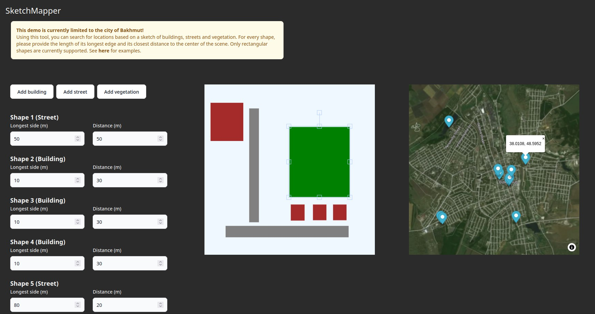

# SketchMapper

## Team Members
albva, mlkin

## Tool Description
Inspired by [OSM Finder](https://github.com/Xetnus/osm-finder), SketchMapper allows users to search for locations based on sketches of buildings, streets and vegetation. Internally, it transforms OpenStreetMap data into an graph of adjacent spatial objects, additionally considering various features such as the relative size of geometries, distances and angles between objects. Given the user's input, the scenes with the least percentage deviation from the provided sketch are returned.

## Installation
The software consists of a data importer, an API and a visual interface. 

### Run locally
You need access to a Neo4j database where the data was previously imported in, as well as a vector map tiles URL (e.g. from MapTiler). The .env file should have the following entries: VITE_API_URL, VITE_API_KEY, VITE_TILES_URL

1. Open the terminal and run: 
      ```git clone https://github.com/mlkin/sketchmapper.git && cd sketchmapper```
      
2. Install and run the server:
      ```cd server && npm install && npm run dev```
      
3. Install and run the frontend by opening a second terminal in the inner sketchmapper directory:
      ```npm install && npm run dev```

### Import new data
You need access to an empty Neo4j instance as well as a PostGIS instance to perform the geometric operations. The .env file in the osm directory should contain: NEO4J_HOST, NEO4J_USER, NEO4J_PASSWORD, PG_CONNECTION

1. Obtain your OpenStreetMap extract (e.g. [here](https://extract.bbbike.org), in PBF)

2. Use a tool like [osm2pgsql](https://osm2pgsql.org) to import the extract into your database

3. Open a terminal in the osm directory and install the dependencies:
      ```pip install -r requirements.txt```
      
4. Run the import (May take several minutes for one city):
      ```python import_osm.py```

## Usage


Draw shapes corresponding to buildings, streets and vegetation and provide the approximate length of their longer edge as well as their shortest distance to the center of the scene. This way, the algorithm can understand the dimensions of the drawn sketch.

## Next steps
- Incorporate new features (building floors, street curvatures, shop names...)
- Allow more shapes to be drawn (currently only rectangles)
- Increase the sampling resolution (currently around 30 m)
- Automatically generate scenes from photos
